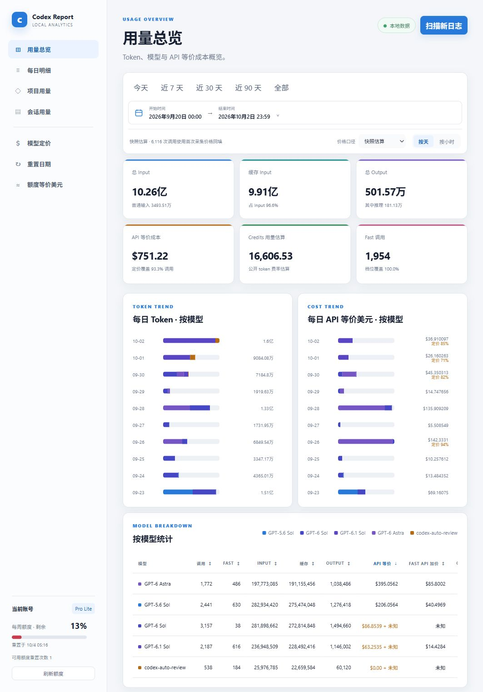
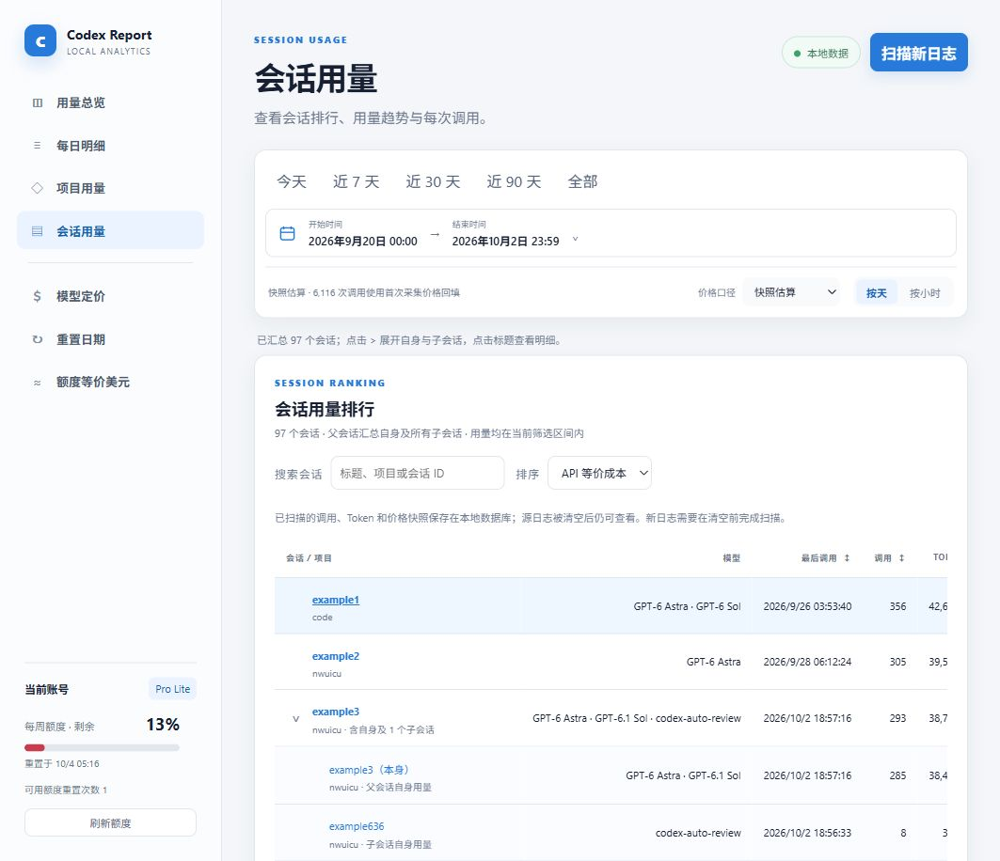
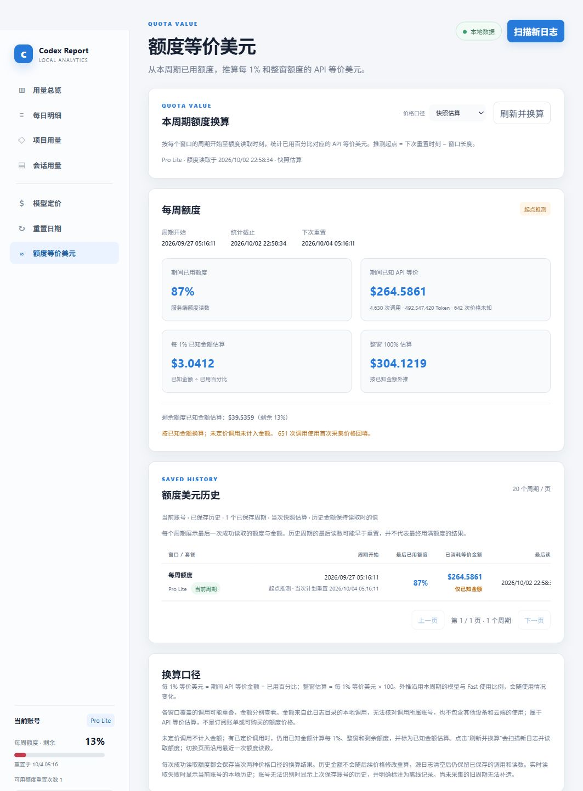

# Codex Token Report

Windows版本的codexbar总是统计不了当日用量, 于是纯Vibe Coding做了一个Web版本.

只读扫描 Codex 会话日志, 用浏览器查看 Token、Standard/Fast API 等价成本、Credits 估算, 以及已采集的账号额度与重置历史. 

统计保存到本地 SQLite, 源日志清空后仍可查看已经采集的记录. 

## 功能速览

| 功能 | 可以查看或操作 |
| --- | --- |
| 用量总览 | Input、Cache read、Cache write、Output、模型用量、Standard/Fast 等价美元与 Credits 估算; 支持按天、按小时和精确时间范围统计. 无公开价格模型的用量单独保留. |
| 模型定价 | models.dev 价格缓存、手工覆盖、调用时保存的价格快照, 以及按当前价格重算. |
| 项目与会话 | 按 Git 项目归并用量; 查看父子会话树、搜索和排序会话, 展开逐调用明细与趋势. |
| 额度与重置 | 当前登录账号的实时额度读数、确认或推测的重置时刻、周期美元换算、保存的历史与离线查看. |
| 历史持久化 | 保存逐调用 Token、档位证据、会话元数据、价格快照和已采集额度; 源日志清空、归档或截断后继续保留. |
| CSV 导出 | 导出当前日期范围、统计粒度和价格口径下的用量明细. |

API 等价金额属于估算, 不是订阅账单. 当前调用统计尚未按账号区分, 额度换算和跨机
历史显示的限制见下方“当前账号额度”和“备份与跨机迁移”. 

## 应用截图

用量总览: 



会话用量: 



额度等价美元与保存的周期历史: 



## 部署说明

 Python 3.12 或更新版本、`uv`, 以及本机可读取的 Codex 日志目录. 

下载或克隆仓库后, 在仓库根目录运行下列命令. 浏览器版本不需要安装 `desktop` 或开发依赖; 实时账号额度
另需可用的 Codex CLI 和 ChatGPT 登录, 已有历史查看与本地日志统计不依赖实时额度查询. 

### Windows（PowerShell 7）

```powershell
uv sync --locked
uv run codex-token-report
```

默认打开 `http://127.0.0.1:8765`. 

```powershell
.\codex_ana.bat
```

### macOS / Linux（终端）

两者使用相同的浏览器服务入口, 分别在 macOS 的终端或 Linux 的 shell 中运行: 

```sh
uv sync --locked
uv run codex-token-report
```

默认地址 `http://127.0.0.1:8765`. 实时额度查询需要当前终端的 `PATH` 中存在
`codex`, 或通过 `CODEX_TOKEN_REPORT_CODEX_BIN` 指定可执行文件; Windows 桌面版 CLI
的自动查找逻辑不适用于 macOS / Linux. 例如在这两个平台的 shell 中设置: 

```sh
export CODEX_TOKEN_REPORT_CODEX_BIN="/path/to/codex"
```

> 更新代码后, 需要关闭旧服务并重新运行 `uv run codex-token-report`, 再刷新页面. 
> 后端不会自动重载; 若页面与运行中的后端版本不匹配, 统计区会明确提示重启. 
>
> 首次启动扫描所选 Codex 目录中的 `sessions`、`archived_sessions` 和 `logs_2.sqlite`. 
> 默认读取环境变量 `CODEX_HOME`, 未设置时使用当前用户主目录下的 `.codex`: Windows
> 为 `$env:USERPROFILE\.codex`, macOS / Linux 为 `~/.codex`. 通过 `--codex-home` 可以覆盖. 
>
> 统计数据库默认位于 Windows 的 `$env:LOCALAPPDATA\CodexTokenReport\usage.sqlite3`, 
> macOS / Linux 为 `~/.local/share/codex-token-report/usage.sqlite3`. 可通过 `--data-dir`
> 或 `CODEX_TOKEN_REPORT_DATA_DIR` 指定持久数据目录; 不要把它放进将被清空的日志目录. 

## 常用命令

只更新本地统计数据库, 不启动网页: 

```powershell
uv run codex-token-report --scan-only
```

指定 Codex 目录和数据目录（Windows / PowerShell）: 

```powershell
uv run codex-token-report `
  --codex-home "$env:USERPROFILE\.codex" `
  --data-dir "$env:LOCALAPPDATA\CodexTokenReport"
```

macOS / Linux 对应命令: 

```sh
uv run codex-token-report --codex-home "$HOME/.codex" --data-dir "$HOME/.local/share/codex-token-report"
```

使用可选桌面窗口外壳（依赖 pywebview; macOS / Linux 未实测, 浏览器版本可独立运行）: 

```powershell
uv sync --extra desktop
uv run codex-token-report-desktop
```

## 开发与测试

```powershell
uv sync --locked --extra dev
uv run ruff check src tests scripts
uv run pytest
```

# 感谢

部分计算参考 [CodexBar](https://github.com/steipete/CodexBar)

## 许可证

[GPL-3.0-only](LICENSE)
